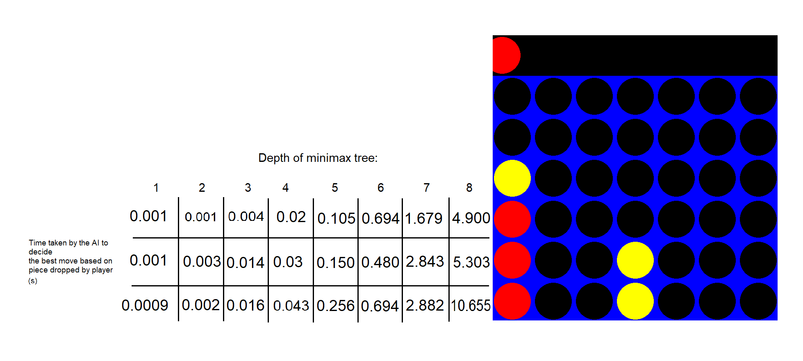

The program is divided into four python files. Connect4_ai.py has the AI's functionality i.e. the implementation of the minimax algorithm and alpha-beta pruning.
Connect4_ui.py has the user interface and the pygame loop. Connect4_utils.py has some of the functionality that several files use.
Constants.py has all constants. The game is executed through connect4.py.

The gameplay doesn't allow the player yet to choose the AI's difficulty i.e. the depth of the minimax algorithm calls.
This could be a future feature. Also, the heuristic scoring system may be flawed and hasn't yet been tested well enough to give the best results.
I have also noticed that the minimax algorithm's process time takes a lot longer when focused in the right edge of the board.

ChatGPT has been used to help the calculation and analyzation of the code's time complexity.

Sources: \
https://www.youtube.com/watch?v=MMLtza3CZFM \
https://connect4.gamesolver.org/

## Time Complexity

The ratios between the AI's processing are following:

2.22 (n=2/n=1)\
8 (n=3/n=2)\
2.69 (n=4/n=3)\
5.95 (n=5/n=4)\
2.71 (n=6/n=5)\
4.16 (n=7/n=6)\
3.7 (n=8/n=7)

This suggests that between the depths of the project's best interest (1-8), \
the time and space taken varies and is heavily dependent on how good of a \
scenario the AI's dealt with. However, the time taken by the decision process \
always increases with the depth of the tree. Based on the measurements, the \
time complexity may be close to quadrantic (O(n^2)).