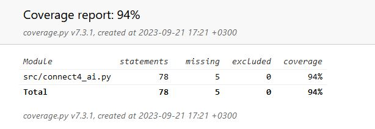

# Testing Document

## Current Testing Coverage

## Tests
There are currently three tests, all testing the algorithm with depth 5. \
The tests mainly test the AI's capability to avoid certain losses and to \
choose certainly winning columns.

The implementation document includes the information on the AI's time complexity.